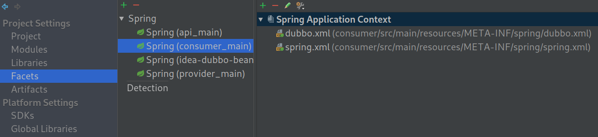
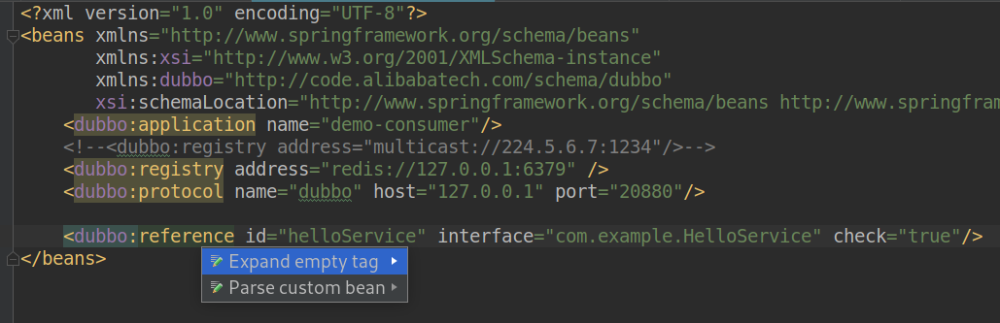
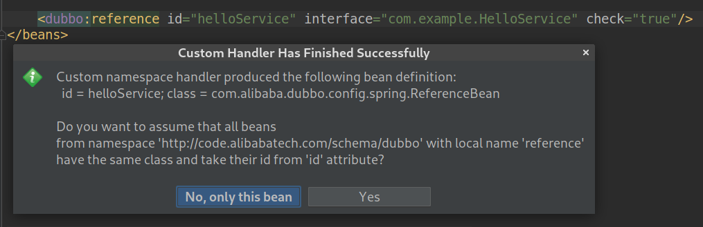
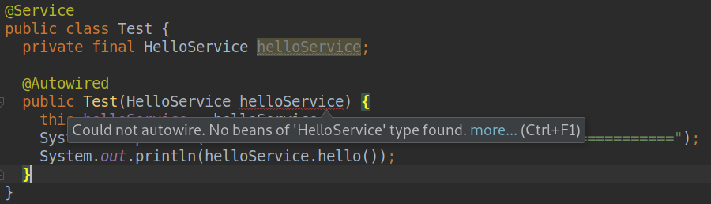

# README

Demo used to demonstrate that IntelliJ IDEA cannot correctly parse custom bean defined by Dubbo's custom tag.

Referenced in [IntelliJ Support forum](https://intellij-support.jetbrains.com/hc/en-us/community/posts/360000215024-IDEA-cannot-properly-parse-custom-bean-defined-by-Dubbo-s-custom-tag).

This demo consists of 3 module:

* api: It provides a service interface (`com.example.HelloService`) which is used by both provider and consumer.
* provider: Service provider.
* consumer: Service consumer.

Provider and consumer should be started separately, and provider should be started first.
 
## Configuration

Configure Spring Facets in IDEA:

For running, you need a redis server listening on 127.0.0.1:6379. It serves as an service registry.
Change redis host and port in `consumer/src/main/resources/META-INF/spring/dubbo.xml` and `provider/src/main/resources/META-INF/spring/dubbo.xml` as needed.

## Problem

In the consumer side, service bean is defined by Dubbo's custom tag: `<dubbo:reference id="helloService" interface="com.example.HelloService" check="true"/>` (in the file `consumer/src/main/resources/META-INF/spring/dubbo.xml`). 
* `id` is arbitrary and serves as bean's `id`.
* `interface` is the service interface which will be used to find the appropriate remote service. It actually serves as the bean's `class`.  

See [Dubbo User Book](https://dubbo.apache.org/books/dubbo-user-book-en/references/xml/dubbo-reference.html) for details about the tag.

The problem is that IntelliJ IDEA parse the custom tag incorrectly as a bean (id=helloService and class=`com.alibaba.dubbo.config.spring.ReferenceBean`), while the expected class is `com.example.HelloService`.

Alt + Enter -\> "Parse custom bean" on the tag gives the following result:

When injecting the bean into a service, IntelliJ IDEA warns that "No beans of 'com.example.HelloService' type found".

